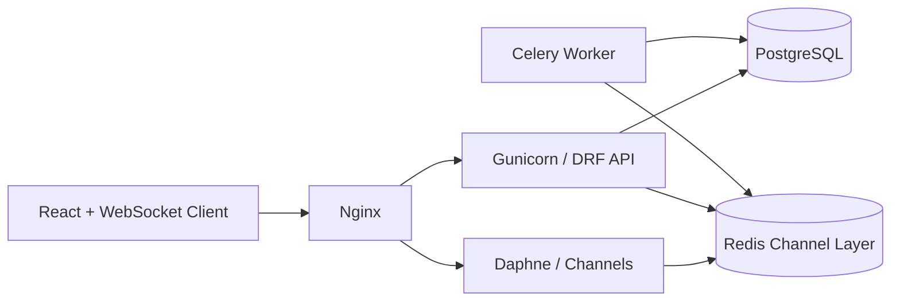

# Syncra

Syncra is a production-shaped real-time chat platform built with Django REST Framework, Django Channels, PostgreSQL, Redis, Celery, React, Vite, Tailwind CSS, Docker, and Nginx.

## Architecture



## Why This Stack

- Django + DRF: fast API development, mature auth, ORM, admin, permissions, serializers, pagination, filtering, and schema tooling.
- Django Channels + Daphne: async WebSocket support for messages, typing indicators, read receipts, and presence.
- PostgreSQL: relational consistency for users, memberships, messages, receipts, notifications, and media metadata.
- Redis: WebSocket fanout, channel layer, caching, Celery broker, and low-latency presence helpers.
- Celery: background email, media processing, notification fanout, and future scheduled cleanup.
- React + Vite + Tailwind: fast frontend development with reusable components and responsive UI.
- Docker + Nginx: repeatable local/prod runtime, API proxying, static/media serving, and WebSocket upgrades.

## Local Setup

1. Copy environment files:

```bash
cp backend/.env.example backend/.env
cp frontend/.env.example frontend/.env
```

2. Start infrastructure:

```bash
docker compose up -d --build
```

3. Run migrations and create an admin:

```bash
docker compose exec backend python manage.py makemigrations
docker compose exec backend python manage.py migrate
docker compose exec backend python manage.py createsuperuser
```

4. Open the app:

- Frontend: `http://localhost`
- API docs: `http://localhost/api/docs/`
- Admin: `http://localhost/admin/`
- WebSocket: `ws://localhost/ws/chats/<chat_id>/?token=<access_token>`

## Backend Structure

```text
backend/
  config/                 Django settings, ASGI, WSGI, Celery, URLs
  apps/accounts/          custom user, profile, auth endpoints
  apps/chats/             chats, members, messages, receipts, consumers
  apps/notifications/     notification models and endpoints
  apps/presence/          online status, last seen, typing state
  apps/mediafiles/        secure upload metadata and validation
  common/                 middleware, services, utilities
```

## Database Design

Core entities:

- `User`: authentication identity with unique email and email verification flag.
- `Profile`: user-facing profile data.
- `Chat`: either `direct` or `group`.
- `ChatMember`: normalized many-to-many table with role and mute fields.
- `Message`: append-heavy message table indexed by `chat_id` and `created_at`.
- `ReadReceipt`: unique read marker per user and message.
- `Notification`: unread/read notification feed.
- `MediaAsset`: uploaded file metadata linked to an owner.
- `UserPresence`: online/offline and last seen.
- `TypingStatus`: latest typing state per user per chat.

The highest-value indexes are on `Message(chat, -created_at)`, `Chat(type, -updated_at)`, `ChatMember(user, chat)`, `Notification(recipient, read_at, -created_at)`, and presence timestamps.

## WebSocket Events

Client sends:

```json
{ "type": "message.send", "body": "hello" }
{ "type": "typing", "is_typing": true }
{ "type": "message.read", "message_id": 42 }
```

Server broadcasts:

```json
{ "type": "message.created", "message_id": 42, "body": "hello", "sender_id": 1 }
{ "type": "typing", "user_id": 1, "is_typing": true }
{ "type": "message.read", "message_id": 42, "user_id": 2 }
{ "type": "presence", "user_id": 1, "online": true }
```

## Production Checklist

- Set strong `DJANGO_SECRET_KEY`.
- Set `DJANGO_DEBUG=False`.
- Set `DJANGO_ALLOWED_HOSTS=syncra.example.com`.
- Set `FRONTEND_URL=https://syncra.example.com`.
- Set PostgreSQL and Redis credentials outside git.
- Configure S3 or Cloudinary for durable media storage.
- Enable HTTPS through Certbot or managed load balancer certificates.
- Add monitoring: Sentry, Prometheus/Grafana, or hosted APM.
- Add backups for PostgreSQL and media.
- Run `python manage.py check --deploy`.

## Resume Description

Built Syncra, a scalable real-time chat platform using Django REST Framework, Django Channels, Redis, PostgreSQL, Celery, React, Vite, Tailwind CSS, Docker, Nginx, and GitHub Actions. Implemented JWT authentication, async WebSocket messaging, group chats, presence, typing indicators, read receipts, notifications, file uploads, API documentation, CI/CD, and production deployment architecture.
